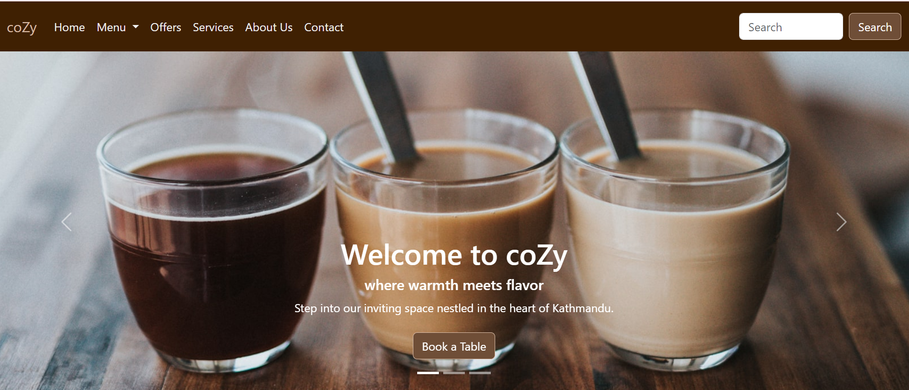

# Project Description
This project utilizes the Bootstrap framework to create a responsive and visually appealing website. While it's still a work in progress, the ultimate goal is to provide comprehensive information about the services, offers, and prices of food and beverages offered by the café.

<h2>Features:</h2>
Responsive design for optimal viewing on various devices.
Utilizes Bootstrap components and utilities for streamlined development.
Planned sections include:

*   Services: Information about the café's offerings.
*   Offers: Special deals and promotions.
*   Prices: Detailed pricing information for food and beverages.

<h2>Preview:</h2>
The home page of the café provides an initial glimpse into the project's layout and design.

Note:
Please note that this project is still under development and may not represent the final product.

